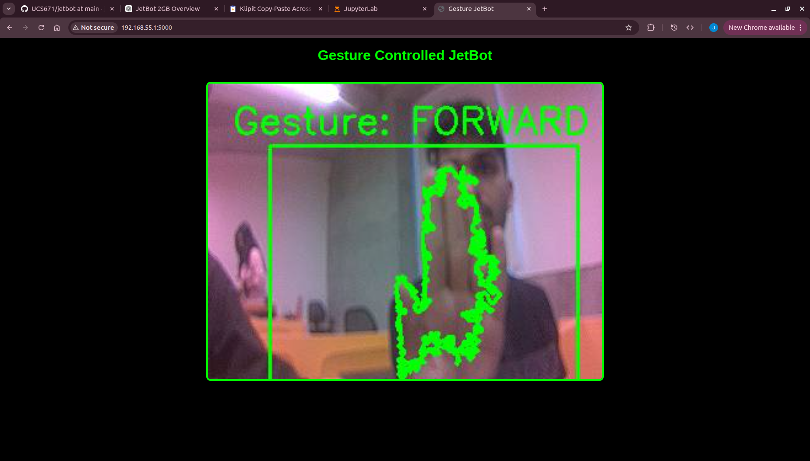

# 🤖 Gesture Controlled JetBot Navigation and Live Dashboard

Real-time gesture-controlled robotic navigation system built using NVIDIA JetBot, Jetson Nano 2GB, OpenCV and Flask.

The project enables touchless robot control through computer vision and streams a live dashboard wirelessly through a browser.

---

## 📷 Demo

Dashboard output:



---

## 🚀 Features

- Real-time hand gesture recognition
- Wireless Flask dashboard
- Live camera streaming
- Touchless robot control
- OpenCV-based image processing
- Embedded vision on Jetson Nano
- Stable motor command handling
- Low-resource optimization for Jetson Nano 2GB

---

## 🛠 Hardware Used

| Component | Purpose |
|------------|----------|
| Jetson Nano 2GB | Embedded AI processing |
| JetBot kit | Robot platform |
| CSI Camera | Live video input |
| Battery Pack | Power supply |
| Motor Driver | Wheel movement |
| WiFi | Wireless control |

---

## 💻 Software Stack

- Python
- OpenCV
- Flask
- JetBot API
- GStreamer
- NumPy

---

# System Workflow

```text
Camera Feed
      ↓
Frame Capture
      ↓
ROI Selection
      ↓
HSV Conversion
      ↓
Skin Segmentation
      ↓
Contour Detection
      ↓
Gesture Recognition
      ↓
Robot Commands
      ↓
Motor Driver
      ↓
Robot Movement
      ↓
Flask Dashboard
```

---

## 🔌 JetBot Setup

### Step 1: Power ON JetBot

- Charge battery
- Connect jumper
- Switch ON JetBot

Do not use USB-C power.

---

### Step 2: Connect using SSH

```bash
ssh csed@192.168.55.1
```

Password:

```bash
cslab768
```

---

### Step 3: Connect JetBot to WiFi

```bash
sudo nmcli device wifi connect AI-Lab password ai@tiet25
```

---

### Step 4: Find IP

```bash
ifconfig
```

Check:

```bash
wlan0
```

Example:

```bash
172.16.xx.xx
```

---

### Step 5: Open Jupyter

Open browser:

```bash
https://JETBOT_IP:8888
```

Password:

```bash
jetbot
```

---

## 🎯 Gesture Logic

| Hand Position | Robot Action |
|---------------|--------------|
| Up | Forward |
| Down | Backward |
| Left | Left |
| Right | Right |
| Center | Stop |

---

## ▶ Running Project

Performance mode:

```bash
sudo nvpmodel -m 0
sudo jetson_clocks
```

Run:

```bash
python3 app.py
```

Open dashboard:

```bash
http://JETBOT_IP:5000
```

---

## 📁 Project Structure

```text
gesture-jetbot-dashboard/
│
├── app.py
├── README.md
├── requirements.txt
│
├── static/
│   └── screenshots/
│        └── dashboard.png
│
├── notebooks/
│   ├── camera_test.ipynb
│   ├── gesture_test.ipynb
│
├── docs/
│   └── report.pdf
│
└── videos/
    └── demo.mp4
```

---

## 📚 Concepts Used

- Embedded Vision
- OpenCV
- Human-Robot Interaction
- Real-time Processing
- Robotics
- Image Processing
- Flask Streaming
- Computer Vision
- Edge Computing

---

## ⚠ Challenges Faced

- TensorRT errors
- Camera frame failures
- Camera blur
- Flask lag
- Multiple camera access conflicts
- Jetson Nano memory limitations

---

## 🔥 Future Improvements

- MediaPipe hand tracking
- Object tracking
- SLAM mapping
- Voice control
- Obstacle avoidance
- ROS integration

---

## 👨‍💻 Author

Jayant Singh Khanna
